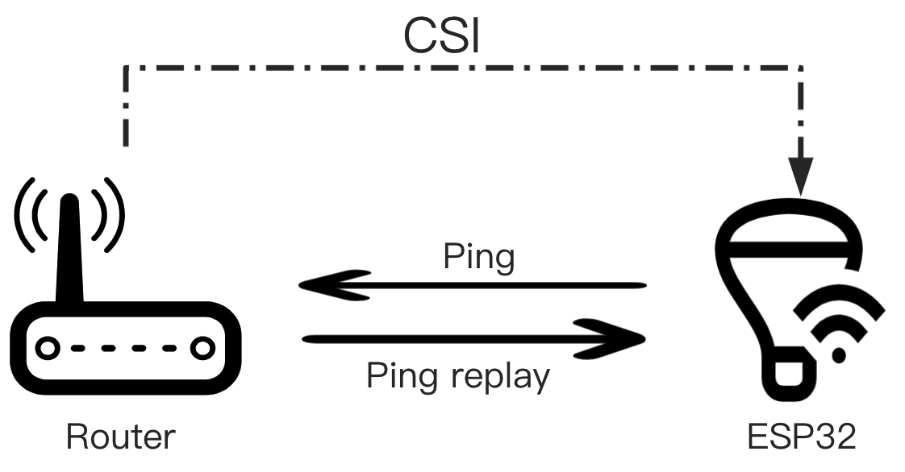
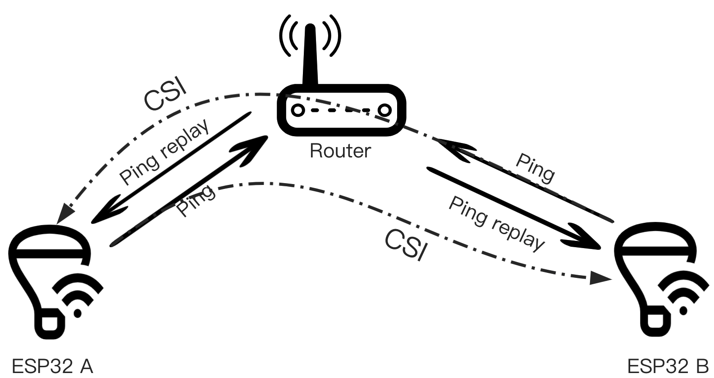
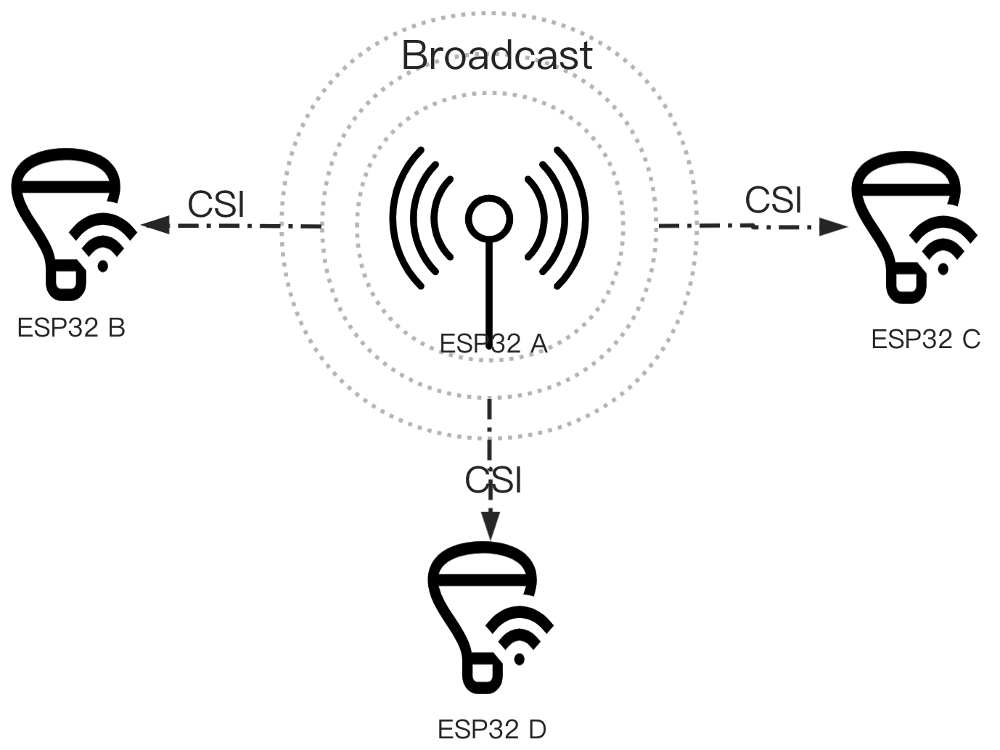

# ESP-CSI

The main purpose of this project is to show the use of ESP-WIFI-CSI. The human body detection algorithm is still being optimized. You can get more accurate results through machine learning, neural network and other algorithms based on the original CSI data.

## 1 Introduction

### 1.1 Introduction to CSI

Channel state information (CSI) includes specific indicators such as carrier signal strength, amplitude, phase, and signal delay. These indicators reveal the signal scattering, reflection, and power attenuation phenomena that occur with the carrier as the transmission distance changes. It can be used to measure the channel status of the wireless network in Wi-Fi communication. By analyzing and studying the changes in CSI, we can conversely speculate on the changes in the physical environment that cause the changes in the channel state, that is, to achieve non-contact intelligent sensing. CSI is extremely sensitive to environmental changes. In addition to perceiving environmental changes caused by large movements such as walking and running of people or animals, it can also capture subtle movements caused by small movements such as breathing and chewing of people or animals in a static environment.

### 1.2 The relationship between CSI and RSSI

RSSI is the energy characteristic of the Media Access Control (MAC) layer. CSI uses a more fine-grained wireless channel measurement than RSSI, so CSI has some inherent advantages in terms of information. In an indoor environment, the signal sent by the transmitter passes through multiple propagation paths and undergoes reflection and scattering before reaching the receiver. Human behavior will inevitably cause major changes in signal propagation channels by changing multipath. RSSI, as the superposition of channel strength, cannot clearly reflect the channel changes, which greatly reduces the detection rate. Different from RSSI, because the superposition of the multipath signal exchange layer has the characteristics of rapid change, the power characteristics and channel response of the physical layer CSI can distinguish the multipath characteristics. Conceptually, the channel response is the response to RSSI, just like the response of the rainbow to the solar beam, the components of different wavelengths are separated, and OFDM is the medium that refracts RSSI into CSI.

### 1.3 Advantages of CSI

CSI is a physical layer characteristic.Compared with other indicators, CSI amplitude shows some advantages:

1. **Anti-interference:** CSI amplitude is essentially the attenuation coefficient of a set of channels. As long as the channel itself does not change, it is quite robust to interference from power adaptors and other jumpers.
2. **More fine-grained:** CSI does not use synthetic values ​​(such as RSSI) to measure the channel, but decomposes the entire channel measurement into sub-carriers, and estimates the frequency response of each sub-carrier, so as to determine the channel in the frequency domain. Make a more fine-grained description.

### 1.4 Espressif CSI Advantage

1. **All ESP32 series support CSI:** ESP32 / ESP32-S2 / ESP32-C3.
2. **Powerful ecology:** Espressif is a global leader in the field of Wi-Fi MCUs, combining CSI with existing IOT equipment.
3. **More information:** Such as RSSI, RF noise floor, reception time and antenna `rx_ctrl` field.
4. **Bluetooth Assist:** ESP32 also supports BLE, for example, it can scan surrounding devices to assist detection.
5. **Powerful processing capability:** ESP32 CPU handles dual-core, 240MHz, AI instructions. Can run machine learning and neural networks.

## 2 CSI Application

### 2.1 Human activity detection and recognition

Select high-sensitivity sub-carrier combinations and signals from non-line-of-sight path directions in different multipath propagation environments, thereby enhancing the sensitivity of passive person detection and expanding the detection range. This method can form "no blind spot" intruder detection in security applications. The multipath propagation characteristics of wireless signals indoors make wireless perception have natural advantages in sensing range and directionality.

### 2.2 Positioning and ranging

You can learn from the RSSI method and use CSI as a more informative fingerprint (including information on signal amplitude and phase on multiple subcarriers), or rely on a frequency selective attenuation model for more accurate ranging.

### 2.3 Human activity detection and recognition

Use CSI's high sensitivity to environmental changes to recognize human movements, gestures, breathing and other small movements and daily activities.

## 3 Getting Started

The Getting Started project can be found in the [examples/console_test](./examples/console_test) directory. It will help you build a human activity detection application. See: [README](./examples/console_test/README.md).

## 4 How to get CSI

### 4.1 Get router CSI

- **How ​​to implement:** ESP32 sends a Ping packet to the router, and receives the CSI information carried in the Ping Replay returned by the router.
- **Advantage:** Only one ESP32 plus router can be completed.
- **Disadvantages:** Depends on the router, such as the location of the router, the supported Wi-Fi protocol, etc.
- **Applicable scenario:** There is only one ESP32 in the environment, and there is a router in the detection environment.

### 4.2 Get CSI between devices

- **How ​​to implement:** ESP32 A and B both send Ping packets to the router, and ESP32 A receives the CSI information carried in the Ping Replay returned by ESP32 B, which is a supplement to the first detection scenario.
- **Advantage:** Does not depend on the location of the router, and is not affected by other devices connected under the router.
- **Disadvantage:** Depends on the Wi-Fi protocol supported by the router, environment.
- **Applicable scenario:** There must be more than two ESP32s in the environment.

### 4.3 Get CSI specific devices

- **How ​​to implement:** The packet sending device continuously switches channels to send out packets. ESP32 A, B, and C all obtain the CSI information carried in the broadcast packet of the packet sending device. This method has the highest detection accuracy and reliability.
- **Advantages:** The completion is not affected by the router, and the detection accuracy is high. When there are multiple devices in the environment, only one packet sending device will cause little interference to the network environment.
- **Disadvantages:** In addition to the ordinary ESP32, it is also necessary to add a special package issuing equipment, the cost is the same and higher.
- **Applicable scenarios:** Suitable for scenarios that require high accuracy and multi-device cluster positioning.

## 5  note

1. The effect of external IPEX antenna is better than PCB antenna, PCB antenna has directivity.
2. Test in an unmanned environment. Avoid the influence of other people's activities on test results.

## 6 related resources

- [ESP-IDF Programming Guide](https://docs.espressif.com/projects/esp-idf/en/latest/esp32/index.html) is the documentation for the Espressif IoT development framework.
- [ESP-WIFI-CSI Guide](https://docs.espressif.com/projects/esp-idf/en/latest/esp32/api-guides/wifi.html#wi-fi-channel-state-information) is the use of ESP-WIFI-CSI Description.
- If you find a bug or have a feature request, you can submit it on [Issues](https://github.com/espressif/esp-csi/issues) on GitHub. Please check to see if your question already exists in the existing Issues before submitting it.

## reference

* [1]杨 铮，刘云浩.Wi-Fi雷达：从RSSI到CSI[J].中国计算机学会通讯,2014年11月,10(11):55-60.
* [2]谈青青.基于 Wi-Fi 的被动式室内入侵检测与定位技术研究[D].南京:南京邮电大学,2019年4月.
