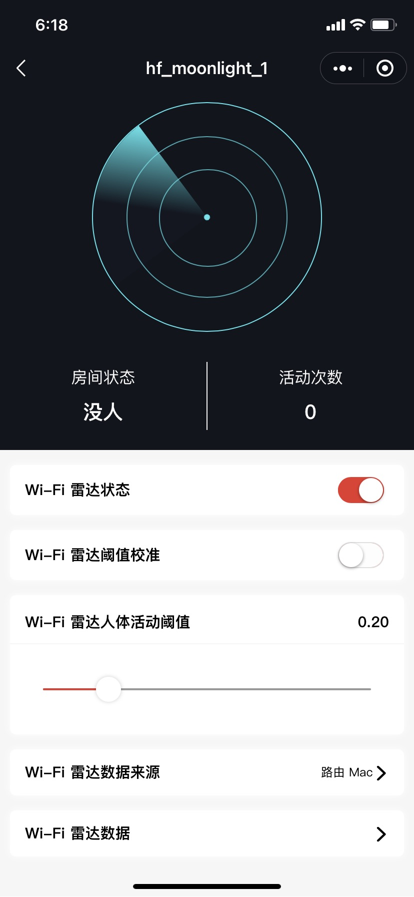
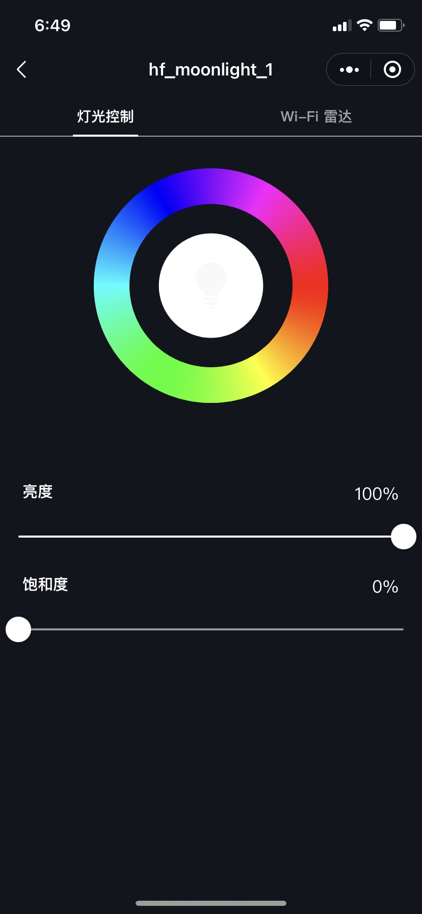
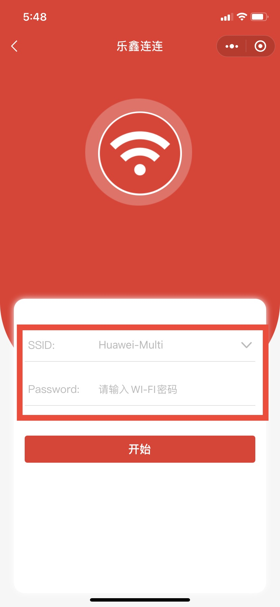
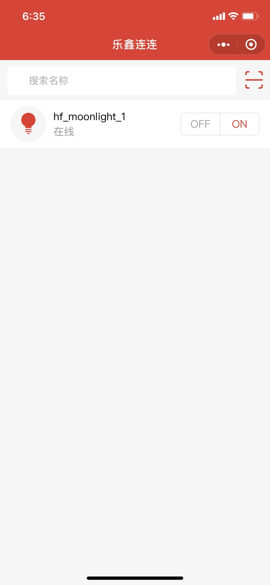
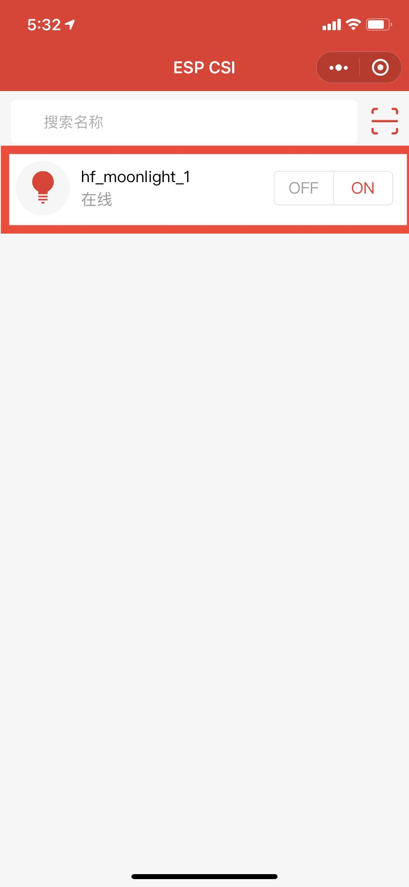
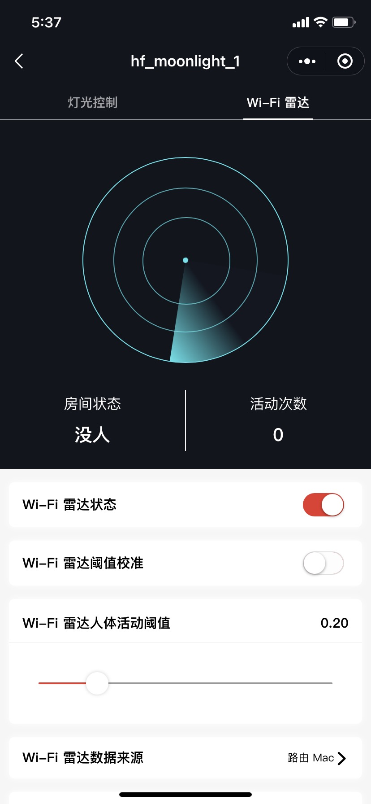
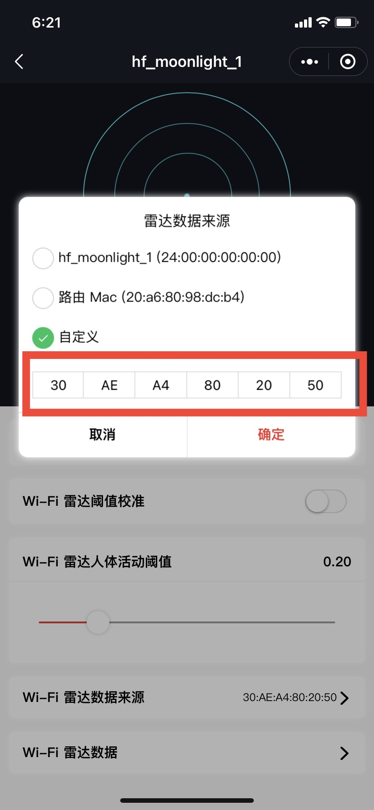
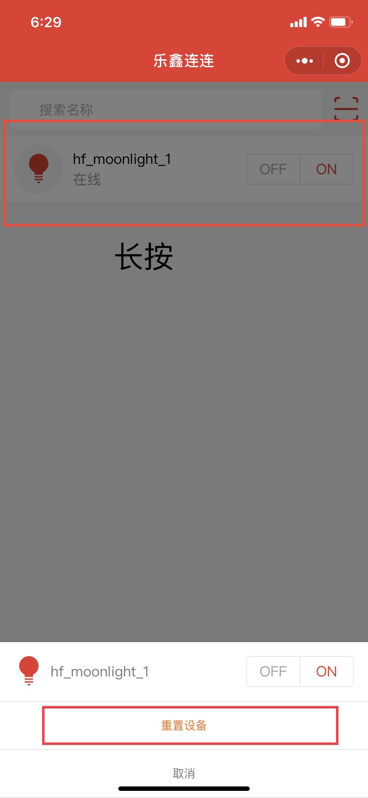

# CSI Demo Example(Wi-Fi radar)

> The CSI demo example and mobile App are currently available for the Chinese market only. We will release internationally after developing web side. Thanks for your keen interest in ESP-WIFI-CSI.

(See the [README.md](../../README.md) file directory for more information about examples.)

## 简介

这是一个人体运动感应的示例，命名为 Wi-Fi 雷达，可以运行在[ESP32-Moonlight 开发板上](https://docs.espressif.com/projects/espressif-esp-moonlight/zh_CN/latest/introduction.html#id2)。当有人运动后，灯会亮起，无人运动后，灯会自行熄灭。在该示例中，您可以通过 ESP-CSI 小程序查看 Wi-Fi 雷达运行状态，调整运行参数，同时也可以直接控制灯光状态。如下：

> ESP-CSI 小程序源码已开源，您可以将其应用在自己的产品里。点击 [ESP-CSI-WeChat](https://github.com/EspressifApps/ESP-CSI-WeChat) 跳转到小程序源码。

<table>
    <tr>
        <td>
        <td>
    </tr>
</table>

> 其他 ESP32 系列开发板也可以运行，但是需要连接 LED 灯以及修改程序才能达到灯亮灯灭的效果。

## 硬件准备

* 1 x QCloud Rader 月球灯
* 1 x 可以联网的路由器
* 1 x ESP32 开发板[可选]

> 使用外置天线可以达到最佳效果。[可选]

## 软件准备

1. 进入 example/connect_qcloud 目录，设置好您的 ESP-IDF 编译环境。
1. 运行 idf.py menuconfig，进入 `ESP QCloud Configuration`，配置三元组信息。更多信息参考：[QCloud 构建&烧录&运行工程](https://github.com/espressif/esp-qcloud#3-%E6%9E%84%E5%BB%BA%E7%83%A7%E5%BD%95%E8%BF%90%E8%A1%8C%E5%B7%A5%E7%A8%8B)。
    > [devices_list.csv](devices_list.csv)里准备了若干个三元组，您可以随机选择若干有效的三元组，烧录到测试设备里。这些三元组数据仅用于测试，可能会有冲突产生，请勿长期使用测试三元组。
1. 编译并烧录 connect_qcloud 固件。
    > 编译固件时需要使用[CMakeLists.txt](../../CMakeLists.txt)指定的 IDF commit id。否则可能无法编译成功。
1. 进入 console_test 目录，编译一份 console_test 固件，并烧录到 ESP32 开发板备用[可选]。

## 开始使用

1. 摆放
    1. 最好先在无人的房间开始配置，或者让检测区域暂时处于无人或少人的状态。[可选]
    1. 确保路由器正常工作，能够访问外网。
    1. 将烧录好固件的月球灯放置于桌面上，上电。

1. 配网
    1. 月球灯处于黄色呼吸状态，代表是配网模式。
    1. 微信搜索 “ESP-CSI” 小程序，或者扫描下方小程序的二维码，打开小程序。
        <table>
            <tr>
            <td>
            </tr>
        </table>
        
    1. 点击小程序中央的 “扫码添加”，扫描下方二维码开始配网。**请勿扫描设备端串口输出的二维码**。
        <table>
            <tr>
                <td>
                <td>
                <td>
            </tr>
        </table>

1. 检查设备是否能够正常工作[可选]
    1. 使用 micro-usb 线缆将 moonlight 接入 PC，查看串口输出。配完网后，如果设备的 csi 功能正常运行，会有如下 log 产生。

        ```txt
        I (69900) esp_qcloud_iothub: property_callback, topic: $thing/down/property/AVGLQX7FYB/hf_moonlight_2, payload: {"method":"report_reply","clientToken":"hf_moonlight_2-82979","code":406,"status":"checkReportData fail"}
        I (70017) app_main: <1> time: 441 ms, rssi: -44, corr: 0.954, std: 0.014, std_avg: 0.000, std_max: 0.000, threshold: 0.200/1.500, trigger: 0/0, free_heap: 110128/120004
        I (70509) app_main: <2> time: 435 ms, rssi: -44, corr: 0.960, std: 0.011, std_avg: 0.000, std_max: 0.000, threshold: 0.200/1.500, trigger: 0/0, free_heap: 110128/121192
        I (71008) app_main: <3> time: 449 ms, rssi: -44, corr: 0.963, std: 0.006, std_avg: 0.000, std_max: 0.000, threshold: 0.200/1.500, trigger: 0/0, free_heap: 110128/121168
        I (71525) app_main: <4> time: 458 ms, rssi: -44, corr: 0.968, std: 0.007, std_avg: 0.000, std_max: 0.000, threshold: 0.200/1.500, trigger: 0/0, free_heap: 110128/121044
        I (72011) app_main: <5> time: 436 ms, rssi: -42, corr: 0.979, std: 0.005, std_avg: 0.000, std_max: 0.000, threshold: 0.200/1.500, trigger: 0/0, free_heap: 110128/121192
        I (72508) app_main: <6> time: 447 ms, rssi: -42, corr: 0.935, std: 0.023, std_avg: 0.000, std_max: 0.000, threshold: 0.200/1.500, trigger: 0/0, free_heap: 110128/121192
        I (73006) app_main: <7> time: 444 ms, rssi: -43, corr: 0.947, std: 0.023, std_avg: 0.000, std_max: 0.000, threshold: 0.200/1.500, trigger: 0/0, free_heap: 110128/121192
        ```

    1. 默认情况下，ESP32 会启动一个 ping 服务，每隔 10 ms 发出一个 ping 包到路由器的网关 IP，正常情况下路由器会回复 ping response，回复数据里携带固定长度的 CSI 信息。如果 ESP32 缺少上述 log ，说明 ESP32 没有获取到 CSI 信息，或者 CSI 信息被过滤。可能有如下情况会导致上述问题。如果您遇到该问题，请参照**备选方案**。
        * 路由器回复包里没有 CSI 信息
        * 路由器回复包的 CSI 信息被过滤，原因是长度不等于 384。
            > 不建议手动修改长度过滤条件，原因是会影响检测算法。

1. 设置

    1. 点击小程序主页里设备列表里的设备，进入该设备的详情页面。
    1. 确认 Wi-Fi 雷达数据来源，默认情况下是路由器的 MAC 地址。
    1. 通过调整 Wi-Fi 雷达人体活动阈值，可以达到最佳效果（减小阈值提高灵敏度，但容易误触发，最优值取决与实际使用环境）
        <table>
            <tr>
                <td>
                <td>
            </tr>
        </table>

## 备选方案

如果您的路由器提供的 CSI 数据无法满足 wifi-rader-light 需求，那么您可以使用以下的备选方案。原理是用 ESP32 开发板来提供 CSI 数据。wifi-rader-light 本身会同时处于 STA 和 AP 模式，AP 模式下默认的 ssid 是 “qcloud_csi_test”,没有密码。使用另一块开发板，然后连接到 wifi-rader-light 的 AP 上，并不停的发出 ping 包给 wifi-rader-light，此时，wifi-rader-light 就能获取到满足要求的 CSI，具体操作步骤如下：

1. 取出烧录有 [console_test](../console_test) 固件的开发板，依次运行以下命令。

    ```shell
    sta qcloud_csi_test # 连接到 qcloud_csi_test ap 上
    ping 192.168.4.1 # 开始发 ping 包
    ```

1. 打开 ESP-CSI 小程序，打开设备的 Wi-Fi 雷达页面，设置 Wi-Fi 雷达数据来源为自定义，然后输入开发板的 STA 的 MAC 地址。
    

## 常见问题

1. 如何重置设备

    重复开关 3 次即可重置设备，重新进入配网模式。或者 ESP-CSI 小程序里，长按设备图标，弹出对话框后点击重置设备。
    <table>
        <tr>
            
        </tr>
    </table>

1. 设备反复打印 `wifi:unknown csi bug!`.

    这是一个已知问题，可以使用备选方案，然后忽略这些打印。或者尝试更换路由器后在进行测试。
