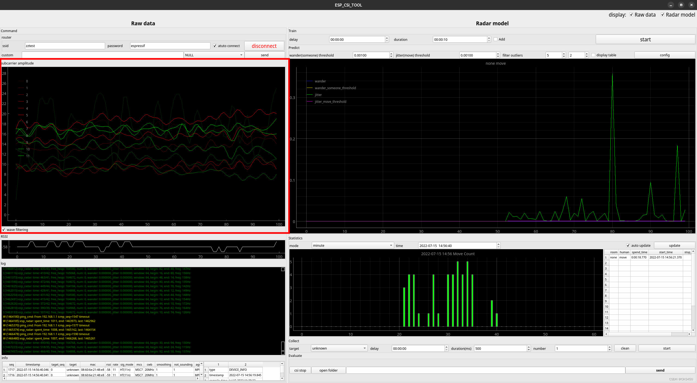
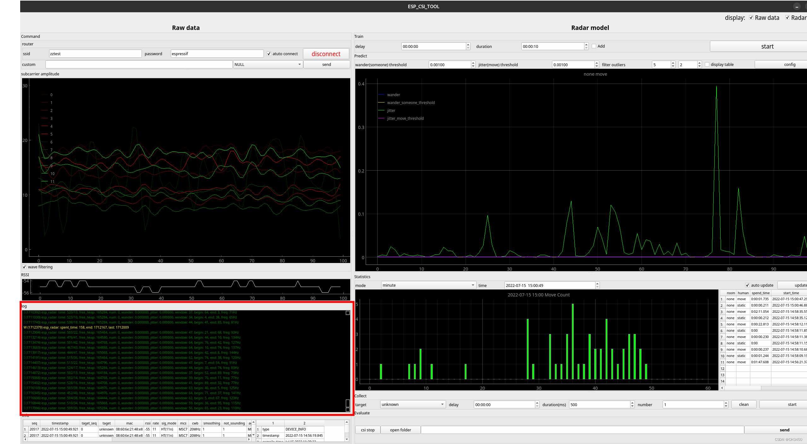
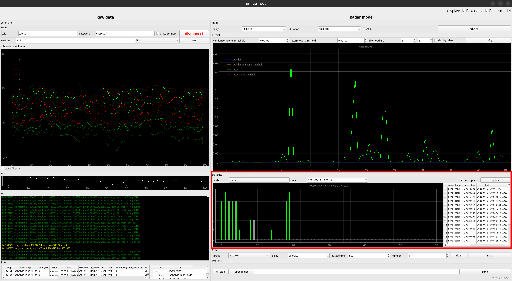
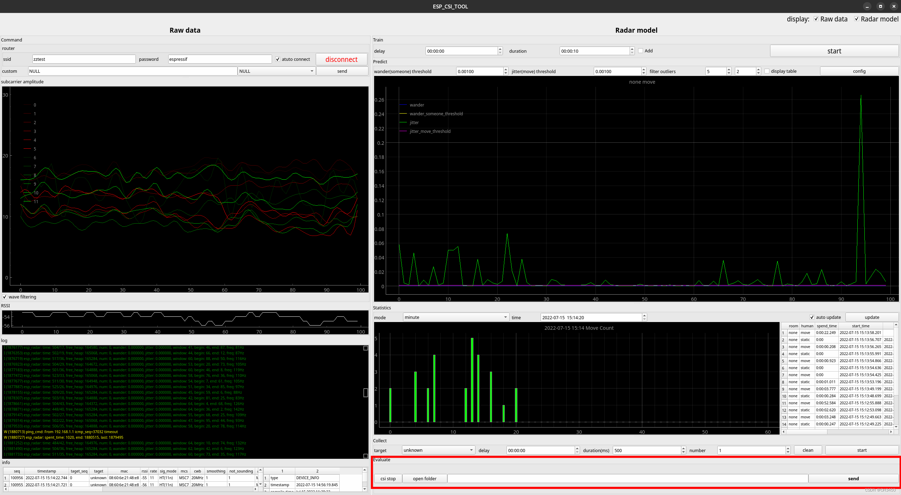
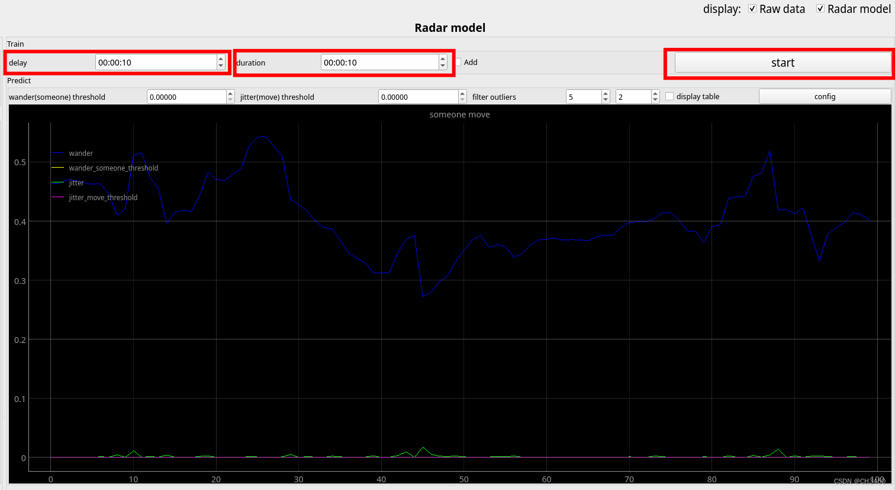
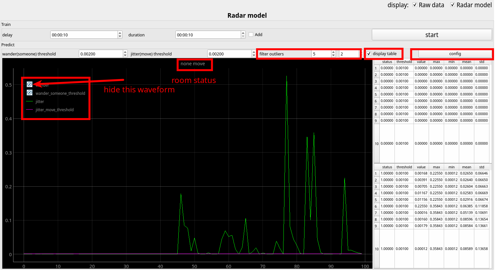
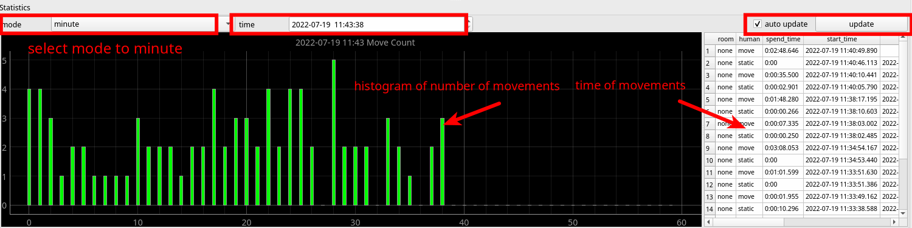
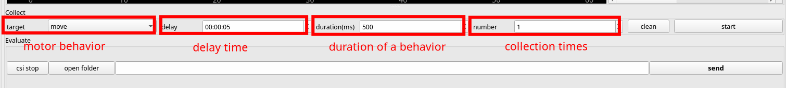
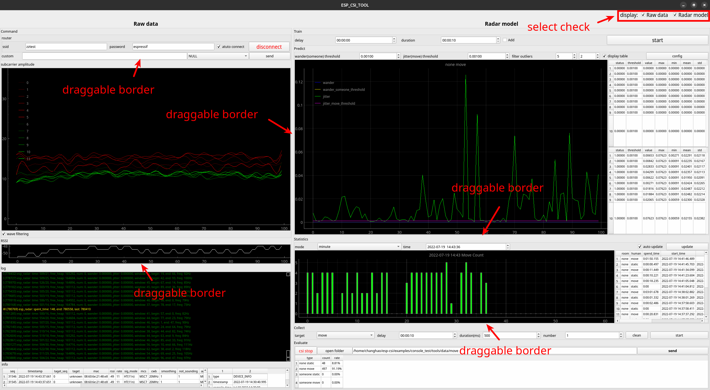

# esp-csi console_test [[中文]](./README_cn.md)
----------
## 1 Introduction
This example provides a test platform for Wi-Fi CSI, which includes functions such as data display, data acquisition and data analysis, which can help you quickly understand Wi-Fi CSI.
+ **Display**：you can quickly understand the impact of different antennas, human movement and equipment placement on Wi-Fi signals by viewing the real-time data such as Wi-Fi RF noise bottom, CSI, RSSI and noise floor of RF.
+ **Acquisition**：All collected Wi-Fi CSIS will be stored in files. You can also mark the data for different motor behaviors for later neural network and machine learning.
+ **Analysis**：It can realize the detection of human movement and whether there are people in the room, and help you quickly the application scenario of Wi-Fi CSI.
## 2 Equipment preparation
### 2.1 Equipment

This example provides two working modes of `esp32-s3 development board` and `router` as Wi-Fi CSI contracting equipment. Using `esp32-s3 development board` as contracting equipment has better adjustment effect on contracting rate, RF size and channel. In both modes, `esp32-s3 development board` is used as the receiving device for Wi-Fi CSI.

### 2.2 Compiler Environment
The esp-idf version of the current project is [ESP-IDF Release v5.0.2](https://github.com/espressif/esp-idf/releases/tag/v5.0.2)
```bash
cd esp-idf
git checkout v5.0.2
git submodule update --init --recursive
./install.sh
. ./export.sh
```
> Note: Since esp-idf v5.0.0 or above supports destination address filtering, the effect will be better, so it is recommended to use v5.0.0 or above

## 3 Starting program
### 3.1 Send Wi-Fi CSI
+ **Use esp32-s3 to send CSI**：Burn project  `csi_send` to esp32-s3 development board
  
    ```bash
    cd esp-csi/examples/get-started/csi_send
    idf.py set-target esp32s3
    idf.py flash -b 921600 -p /dev/ttyUSB0 monitor
    ```
+ **Use router to send CSI**：The router is not connected to other intelligent devices to avoid network congestion affecting the test effect.

### 3.2 Receive Wi-Fi CSI
+ Burn project `console_test` to another esp32-s3 development board
    ```bash
    cd esp-csi/examples/console_test
    idf.py set-target esp32s3
    idf.py flash -b 921600 -p /dev/ttyUSB1
    ```

### 3.3 Start up `esp-csi-tool` ,Open the CSI visualization interface
+ Run `esp_csi_tool.py` in `csi_recv` for data analysis, Please close `idf.py monitor` before running
    ```bash
    cd esp-csi/examples/console_test/tools
    # Install python related dependencies
    pip install -r requirements.txt
    # Graphical display
    python esp_csi_tool.py -p /dev/ttyUSB1
    ```
+ After running successfully, the following CSI data visualization interface is opened. The left side of the interface is the data display interface `Raw data`, and the right side is the data model interface `Raw model`:

## 4 Interface introduction
The real-time visualization interface consists of two parts: the `Raw data` and the `Radar model`. `Raw data` displays the original CSI sub-carrier data, and `Radar model` uses algorithms to analyze the CSI data. As a result, it can be used for detection of someone/noneone, move/static, by selecting the `Raw data` and `Radar model` buttons in the upper right corner, you can choose to display the two interfaces separately.

### 4.1 Router connection window
The top left is the configuration router connection information window. Use the device to connect to the router and receive the CSI between the router and the device.


+ **ssid**：router account
+ **password**：router password
+ **auto connect**：If checked, the next time you turn it on, it will automatically connect to the last connected router.
+ **connect / disconnect**：connect/disconnect button
+ **custom**：You can send more control commands such as: restart, version acquisition, or enter custom commands on the device side

### 4.2 CSI data waveform display window
This window can display the waveform of some channel CSI data in real time. If `wave filtering` is checked, the filtered waveform will be displayed.


### 4.3 RSSI waveform display window
This window displays the RSSI waveform information, which can be used to compare with the CSI waveform to observe the changes of RSSI when the personnel in the room are in different states.


### 4.4 log display window
This window displays system logs such as time, memory, etc.


### 4.5 Wi-Fi channel data display window
This window displays Wi-Fi channel status information.


### 4.6 Room status display window
This window is used to calibrate the room status threshold and display room status ( someone/noneone, move/static ).

+ **delay**：start calibration delay time, no one is required in the room during calibration, and people can leave the room within the delay time after starting calibration.
+ **duration**：calibration process duration.
+ **add**：if checked, the recalibrated threshold will be accumulated on the basis of the current threshold.
+ **start**：start calibration button.
+ **wander(someone) threshold**：the threshold for judging room presence/absence will be set automatically after calibration, or can be set manually by the user.
+ **jitter(move) threshold**：the threshold for judging the move/static of people will be set automatically after calibration, or it can be set manually by the user.
+ **config**：after the user manually sets the threshold, click the configure button.
+ **display table**：if checked, the room status and people status information table will be displayed on the right side of the waveform box. The specific parameters in the table are as follows.
  
    |status|threshold|value|max|min|mean|std|
    |---|---|---|---|---|---|---|
    |room/people status|Judgment threshold|real-time value|maximum value|minimum value|average value|standard deviation|

### 4.7 People movement data display window
This window displays the specific data of indoor people's movement, the bar graph on the left shows the number of people's movement in real time, and the table on the right records the specific movement time.


+ **mode**：observation mode, `minute, hour, day` three modes are to record the number of people's movements per minute, hour, and day.
+ **time**：observation time, the default current time, you can manually set the time to start the observation.
+ **auto update**：if checked, the bar graph of the number of people's movements will be automatically updated and displayed in real time.
+ **update**：after clicking, the bar graph of the number of people's movements will be manually updated and displayed.

The meaning of each parameter in the table is as follows:
|room|human|spend_time|start_time|stop_time|
|---|---|---|---|---|
|room status|people status|spend time of movement|start time of movement|stop time of movement|

### 4.8 Action collection window
This window is used to collect CSI data when people perform different actions. The collected data will be stored under the path of `esp-csi/examples/console_test/tools/data`, and the collected data can be used for machine learning or neural network.


+ **target**：Select the  motor behaviors to collect
+ **delay**：Select the delay time of collection, that is how long to delay to start collection after clicking the `start` button
+ **duration**：The duration of collecting an action
+ **number**：Collection times
+ **clean**：Click to clear all collected data
+ **start**：start collecting button

### 4.9 Model evaluation window
This window is used to evaluate the pros and cons of the adopted thresholds, and to evaluate the accuracy of the room state and people state detection results according to the sent sampling result data.


+ **open folder**：Open the data file of the collecting results.
+ **send**：Send the file, the model will recognize the action after sending, and evaluate the recognition accuracy.

## 5 Operating procedures
Here, taking connecting the router as an example, the operation flow of the visualization system interface is introduced.
### 5.1 connect router
+ Enter the router account and password in turn in the router connection window
+ （option）check `auto connect`
+ Click `connect`

After the connection is successful, you will see the router status information in the "log print window", and the "CSI data waveform display window" will display the CSI data waveform.

### 5.2 Calibration threshold
The purpose of calibration is to let the device know the CSI information when there is no one in the room, and to obtain the threshold of personnel movement. If the current version does not calibrate, only personnel movement detection can be performed. The longer the calibration time, the lower the probability of false touches.


+ Set the delay time of `delay`, here is 10 seconds for example (ie 00:00:10), so that people can leave the room.
+ Set the duration of `duration` calibration, here is 10 seconds as an example.
+ Click `start` and select `yes`, the person leaves the room within 10 seconds (`delay` time), ensure that there is no one in the room within 10 seconds during the calibration period (`duration` calibration duration), and return to the room after the calibration.
+ ( option ) to manually adjust the room status threshold and the person status threshold based on the calibration results.

### 5.3 Observe room status and people status

After the calibration is completed, the room status will be displayed in the room status display window, and it will be judged that there is noneone static, someone moves, and someone static three status.

+ In `filter outliers`, set how many times the threshold is reached in a row to determine the room/people state, so as to filter outliers.
+ Click `config` to configure.
+ ( option ) In the room status waveform window, click the horizontal line in front of `wander` to hide its waveform, which is convenient for observing other waveforms. Similarly, other waveforms can also be hidden by the following method.
+ ( option ) Check `display table` to view the indoor status and people status information table.

### 5.4 Observer movement times and time
In these observation windows, the number of people's movements per minute will be displayed in a histogram according to our settings. The time information of each movement is recorded in the table on the right.


+ In the `mode` of the people's movement data display window, select the observation mode to view the movement of the people in the room in one minute, one hour or one day. Here, choose `minute` as an example.
+ ( option ) Set the time to start the observation in `time`, the default is the current time start.
+ Check `auto update` to automatically update the test results, if not checked, each time you click `update`, the test results will be updated once.

### 5.5 Collect CSI data for a specific action

+ ( option ) Clear previous acquisition data records in `clean` in the motion acquisition window.
+ In `target`, select the action to be collected, here select `move` as an example.
+ In `delay`, set the delayed acquisition time after clicking to start, here is an example of setting a delay of 5 seconds.
+ In `duration`, set the duration of collecting an action in, here we choose 500 ms as an example.
+ In `number`, set the number of times to be collected, here is 1 collection as an example.
+ Click `start`, the system will start collecting data after the delay time, and the personnel will complete the corresponding action within the set time.

After the collection is over, it will stop automatically. We can see the data we collected under the path of `esp-csi/examples/console_test/tools/data`.


### 5.6 Use collected data to identify actions and evaluate accuracy
Collect real-time CSI information, identify the action in real time through the sent data, and display the accuracy rate to evaluate the pros and cons of the set threshold. If the accuracy rate is low, the threshold can be adjusted again.


+ Click `open folder` to select the collected data file
+ Click `send` and select `yes`
+ Click on `csi start`

### 5.7 Window zoom in and out

+ By selecting `Raw data` and `Radar model` in the upper right corner of the interface, the `Raw data` interface and `Radar model` interface can be displayed separately.
+ Select the critical line between different windows with the mouse, and drag and drop to zoom in/out of each window.
