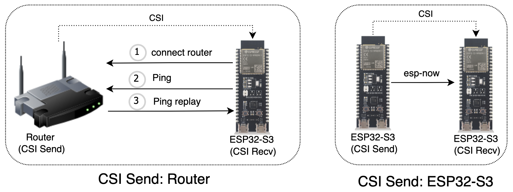

# CSI Test Example
----------------------
## Introduction

This example provides a test platform for Wi Fi CSI, which includes functions such as data display, data acquisition and data analysis, which can help you quickly understand Wi Fi CSI


- **Display**: you can quickly understand the impact of different antennas, human movement and equipment placement on Wi Fi signals by viewing the real-time data such as Wi Fi RF noise bottom, CSI, RSSI and noise floor of RF

- **Acquisition**: all collected Wi Fi CSIS will be stored in files. You can also mark the data for different motor behaviors for later neural network and machine learning

- **Analysis**: it can realize the detection of human movement and whether there are people in the room, and help you quickly the application scenario of Wi Fi CSI

## Equipment preparation

This example provides two working modes of `esp32-s3 development board` and `router` as Wi-Fi CSI contracting equipment. Using `esp32-s3 development board` as contracting equipment has better adjustment effect on contracting rate, RF size and channel


### CSI Send
- `esp32-s3`: Burn csi send project
    ```shell
    # csi_send
    cd esp-csi/examples/get-started/csi_send
    idf. py set-target esp32s3
    idf. py flash -b 921600 -p /dev/ttyUSB0 monitor
    ```

- `Router`: The router is not connected to other intelligent devices to avoid network congestion affecting the test effect

### CSI Recv
- Burn csi recv project
    ```shell
    cd esp-csi/examples/console_test
    idf. py set-target esp32s3
    idf. py flash -b 921600 -p /dev/ttyUSB1
    ```
## esp-csi-tool

Run `esp_csi_tool.py` in `csi_recv` for data analysis, Please close `idf.py monitor` before running

```shell
cd esp-csi-gitlab/examples/console_test/tools

# Install python related dependencies
pip install -r requirements.txt

# Graphical display
python esp_csi_tool.py -p /dev/ttyUSB1
```


1. **Display**: when the contracting equipment is a router, you need to connect the router and send Ping packets first
2. **Calibration**: keep still or no one in the room during calibration
3. **Detection**: the waveform fluctuates up and down when someone moves, and the waveform data becomes low when the person's position changes

## Note
- If running 'ESP CSI tools' fails to send commands or receive data, please restart the device and try again
