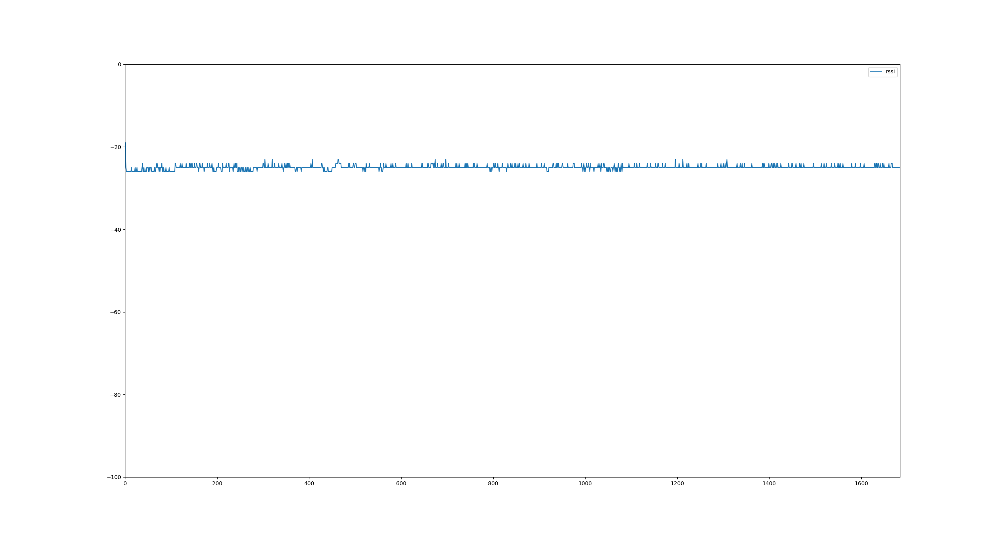
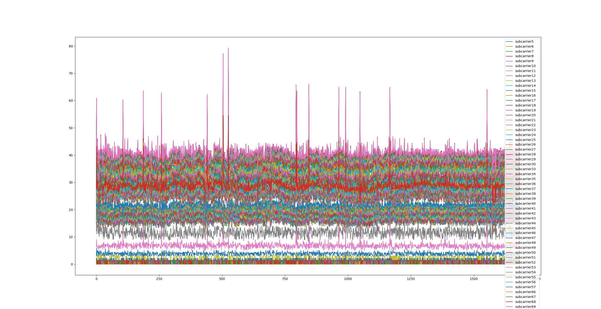

# CSI analysis tools

There are some python script that can be used to analysis the csi data from devices.

## extract_csidata.py

filter_csidata.py is used for extract CSI_DATA from device log.

### How to use extract_csidata.py

Before you use it, you should prepare correct device log file and the file should contain some strings begin with "CSI_DATA".

1. extract csidata from "file.txt" and save it to "file.csv":

    ```bash
    $ ./extract_csidata.py --src ../log.console_test.20210205155636.txt
    Saved csi data to log.console_test.20210205155636.csv
    ```

    if you want to save csv to another file, you can run like this:

    ```bash
    $ ./extract_csidata.py --src ../log.console_test.20210205155636.txt --dst csi_data.csv
    Saved csi data to csi_data.csv
    ``` 

    The output file would be look like this:

    ```csv
    type,id,mac,rssi,rate,sig_mode,mcs,bandwidth,smoothing,not_sounding,aggregation,stbc,fec_coding,sgi,noise_floor,ampdu_cnt,channel,secondary_channel,local_timestamp,ant,sig_len,rx_state,len,first_word,data
    CSI_DATA,0,ac:67:b2:53:8f:31,-26,11,1,7,1,1,1,0,0,0,0,-88,0,13,2,51236189,0,66,0,384,1,"[66,32,4,0,0,0,0,0,0,0,3,0,15,0,15,-1,15,-1,15,-1,15,-1,15,-1,15,-1,15,-2,15,-2,14,-2,14,-2,14,-3,15,-3,15,-3,15,-3,15,-4,15,-4,15,-4,15,-4,15,-4,15,-4,15,-5,14,-5,14,-6,15,-6,15,-7,7,-4,15,-7,15,-7,15,-7,15,-7,16,-7,16,-7,16,-7,17,-7,17,-8,17,-8,17,-8,18,-8,18,-8,18,-8,19,-8,19,-8,19,-7,20,-7,20,-6,20,-6,20,-5,21,-4,20,-4,21,-4,21,-3,21,-2,5,-1,0,0,0,0,0,0,0,0,1,0,4,0,28,3,28,2,28,2,28,2,28,0,28,0,28,0,28,-1,28,-1,28,-1,28,-2,28,-2,28,-3,28,-3,28,-3,28,-4,28,-4,28,-5,28,-5,28,-6,28,-7,28,-7,28,-7,28,-8,28,-8,28,-9,28,-10,28,-10,28,-11,29,-11,29,-11,29,-12,29,-13,29,-13,30,-13,30,-14,30,-14,31,-14,31,-15,32,-15,32,-15,33,-15,34,-15,34,-15,35,-15,35,-15,36,-14,37,-13,37,-13,38,-12,38,-11,39,-10,39,-9,39,-8,40,-7,40,-5,40,-4,12,-2,2,-1,-1,0,-2,0,-1,-1,0,0,0,0,-1,-1,-1,-1,-1,-1,-4,5,-12,23,-13,23,-14,22,-14,22,-15,22,-15,22,-16,21,-16,21,-16,20,-17,20,-17,20,-17,20,-17,19,-18,19,-18,19,-17,19,-17,19,-17,18,-17,18,-17,19,-17,18,-16,18,-16,18,-16,18,-15,19,-15,19,-16,18,-15,19,-15,19,-14,19,-13,20,-13,19,-12,19,-12,20,-12,21,-12,21,-11,21,-11,21,-10,22,-10,22,-9,22,-9,23,-9,23,-8,23,-8,23,-8,24,-7,24,-7,24,-7,25,-6,25,-6,25,-5,26,-5,26,-6,27,-6,27,-5,27,-4,27,-1,3]"
    CSI_DATA,1,ac:67:b2:53:8f:31,-19,11,1,0,1,1,1,1,0,0,0,-88,1,13,2,51249021,0,67,0,384,1,"[67,48,4,0,0,0,0,0,0,0,5,-3,21,-9,20,-10,20,-10,20,-10,20,-10,20,-11,20,-11,19,-11,19,-11,19,-12,19,-13,19,-13,18,-13,18,-13,19,-13,18,-15,17,-15,17,-15,17,-15,18,-16,18,-15,17,-16,17,-16,16,-17,17,-18,17,-19,8,-10,16,-20,16,-20,16,-21,16,-21,17,-22,17,-22,18,-22,17,-22,17,-23,17,-23,18,-24,18,-24,19,-23,19,-24,20,-24,20,-25,20,-25,21,-25,22,-24,23,-23,23,-22,24,-21,24,-21,25,-21,26,-20,27,-19,6,-5,0,0,0,0,0,0,0,0,-1,-1,4,-3,37,-24,37,-25,35,-26,33,-26,35,-22,36,-23,35,-24,35,-24,35,-24,34,-25,33,-25,33,-26,32,-27,33,-27,33,-27,32,-29,32,-30,31,-29,31,-29,30,-31,28,-32,28,-33,27,-33,27,-34,27,-34,27,-35,27,-35,26,-36,27,-38,26,-39,20,-42,24,-39,24,-41,23,-42,23,-42,24,-43,24,-45,23,-46,23,-45,24,-45,25,-47,26,-49,28,-49,28,-49,28,-50,28,-51,29,-50,30,-50,31,-50,31,-50,33,-50,35,-49,37,-48,38,-47,41,-45,43,-43,44,-42,11,-11,-1,-1,0,0,0,0,0,0,0,0,-1,-1,-1,-1,-1,-1,-1,-1,-1,9,-3,38,-4,39,-5,39,-6,39,-7,38,-8,38,-9,38,-9,38,-9,38,-10,38,-11,37,-11,38,-11,37,-12,36,-12,36,-12,36,-11,36,-11,36,-11,35,-11,35,-10,35,-10,34,-10,35,-10,35,-10,35,-8,35,-5,35,-7,34,-6,34,-5,34,-4,34,-4,35,-3,35,-1,35,-1,34,-1,34,0,34,1,35,1,36,2,36,4,36,5,36,6,36,7,36,8,35,9,35,10,36,10,36,10,36,10,37,11,37,11,37,12,37,19,37,21,37,22,36,24,36,3,4]"

    ```

## analisys_csi_data.py

analisys_csi_data.py is used for plot csi waveform.

### How to use analisys_csi_data.py

You must pass the csi_data which is outputed from extract_csidata.py.

1. plot rssi and subcarrier waveform

    ```bash
    $ ./analisys_csi_data.py --src log.console_test.20210205155636.csv
    ```

    it will open 2 windows and display the waveform.

    The waveform would be look like this.

    
    
