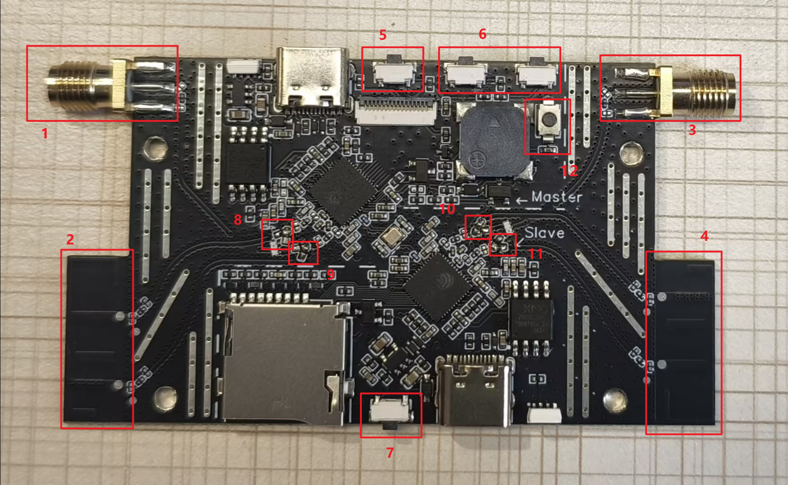
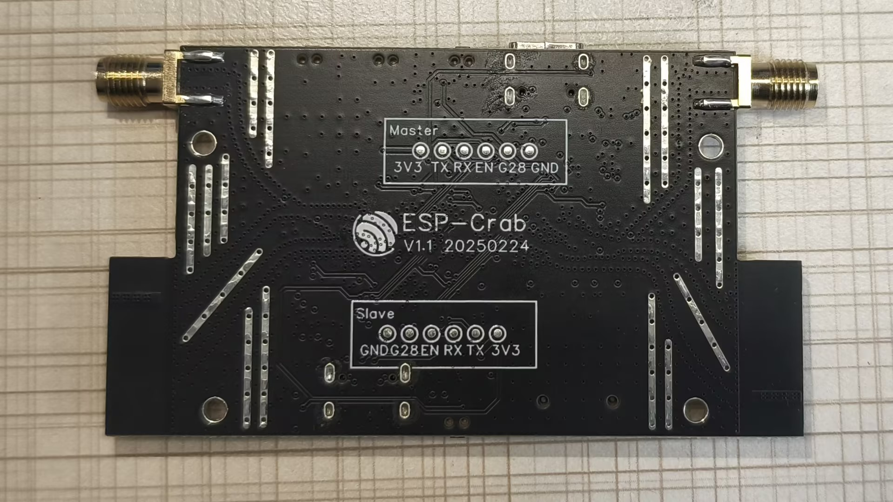
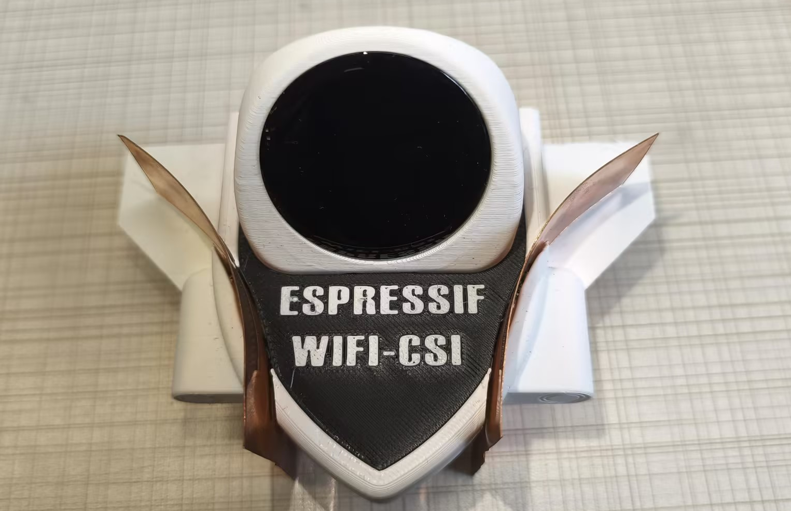
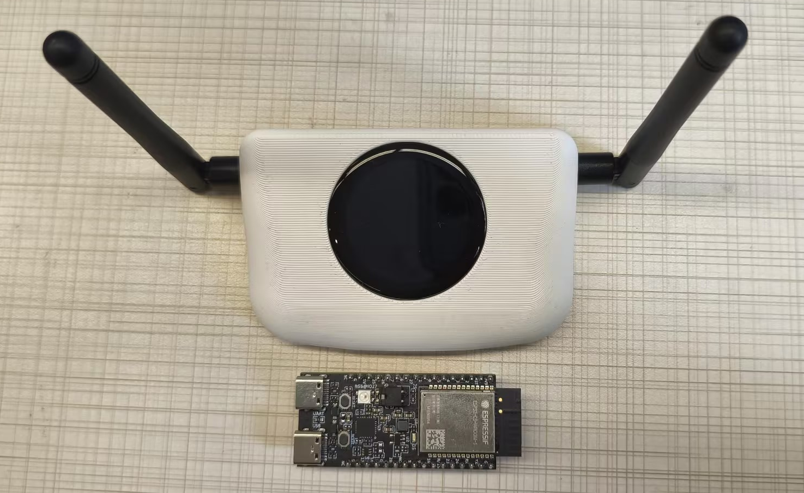

# Co-Crystal Oscillator CSI Reception Example

* [中文版](./README_CN.md)

This example provides a radio frequency phase synchronization solution for Wi-Fi CSI, including three sub-projects: `MASTER_RECV` (master receiver), `SLAVE_RECV` (slave receiver), and `SLAVE_SEND` (slave sender).  
The solution includes two working modes:  
1. Self-transmit-and-receive mode  
2. Single-transmit-and-dual-receive mode

## Feature Introduction

### 1. Self-Transmit-and-Receive Mode

In this mode, two ESP32-C5 chips are used to transmit and receive signals respectively. By analyzing the phase information in the received Wi-Fi CSI signals, disturbances in the signal path can be sensed with millimeter-level accuracy.  
By installing copper sheets to control the RF signal transmission path, the sensing range can also be adjusted, thus supporting high-precision short-range Wi-Fi sensing.  
This enables finer Wi-Fi signal sensing, suitable for precise applications in close-range and complex environments.

  


#### 1.1 MASTER_RECV (Master Receiver)

Flash the `MASTER_RECV` firmware to the **Master** chip of the `esp-crab` device. Its functions include:

* Receiving Wi-Fi packets from the `SLAVE_SEND` and extracting **CIR (Channel Impulse Response)** data.
* Calculating the **amplitude and phase** of Wi-Fi CSI from the CIR and displaying the results.

#### 1.2 SLAVE_SEND (Slave Sender)

Flash the `SLAVE_SEND` firmware to the **Slave** chip of the `esp-crab` device. Its function:

* Transmitting specific Wi-Fi packets.

### 2. Single-Transmit-and-Dual-Receive Mode

In this mode, one ESP32-C5 chip is responsible for signal transmission, while the two ESP32-C5 chips on the `esp-crab` device receive signals.  
By spatially distributing the sender and receivers, Wi-Fi sensing can be realized over a **larger area**.  
The **co-crystal oscillator Wi-Fi CSI data** acquired by the `esp-crab` satisfies the performance requirements of cutting-edge Wi-Fi sensing research, and can be directly integrated with advanced algorithms, further improving the **accuracy and application value** of the sensing system.  
This mode offers strong technical support for **wide-area and complex environment wireless sensing and positioning**.


#### 2.1 MASTER_RECV (Master Receiver)

Flash the `MASTER_RECV` firmware to the **Master** chip of the `esp-crab` device. Its functions include:

* Receiving Wi-Fi packets from `SLAVE_SEND` via antenna and extracting **CIR data**.
* Receiving CIR data from the `SLAVE_RECV` chip (collected via its antenna).
* Calculating the **amplitude and phase difference** of Wi-Fi CSI and displaying the result.

#### 2.2 SLAVE_RECV (Slave Receiver)

Flash the `SLAVE_RECV` firmware to the **Slave** chip of the `esp-crab` device. It supports two modes:

* Receiving Wi-Fi packets from `SLAVE_SEND` and extracting **CIR data**.
* Transmitting the CIR data to `MASTER_RECV`.

#### 2.3 SLAVE_SEND (Slave Sender)

Flash the `SLAVE_SEND` firmware to an extra **ESP32-C5 chip** (e.g., `ESP32-C5-DevkitC-1`). Its function:

* Transmitting specific Wi-Fi packets.

## Required Hardware

### `esp-crab` Device

#### PCB Overview

The RF phase synchronization solution must run on the `esp-crab` device. The images below show the front and back of the PCB:

| No. | Function                          |
|-----|-----------------------------------|
| 1   | Master external antenna           |
| 2   | Master onboard antenna            |
| 3   | Slave external antenna            |
| 4   | Slave onboard antenna             |
| 5   | Master BOOT button                |
| 6   | Master ADC button                 |
| 7   | Slave BOOT button                 |
| 8   | Master 2.4G antenna switch resistor |
| 9   | Master 5G antenna switch resistor |
| 10  | Slave 5G antenna switch resistor  |
| 11  | Slave 2.4G antenna switch resistor |
| 12  | RST button                        |

  


See [PCB V1.1](doc/PCB_ESP_CRAB_ESP32C5_V1_1.pdf) and [SCH V1.1](doc/SCH_ESP_CRAB_ESP32C5_V1_1.pdf) for the PCB schematic and design.

#### Device Form Factor

The `esp-crab` device has two casing styles based on mode:

* Spaceship case for Self-transmit-and-receive mode  
  
* Router-style case for Single-transmit-and-dual-receive mode  
  

### `ESP32-C5-DevkitC-1` Development Board

The Single-transmit-and-dual-receive mode requires an `ESP32-C5-DevkitC-1` board as the Wi-Fi sender.

## How to Use the Example

### 1. Self-Transmit-and-Receive Mode

Power the `esp-crab` via Type-C and it will begin operation. It will display CSI amplitude and phase:

* **Amplitude**: Two curves representing CIR amplitude for -Nsr~0 and 0~Nsr.
* **Phase**: A standard sine curve. The intersection with the red center line represents the CIR phase for 0~Nsr.

At the same time, `esp-crab` will print received CSI data to the serial port in the following format:  
`type,id,mac,rssi,rate,noise_floor,fft_gain,agc_gain,channel,local_timestamp,sig_len,rx_state,len,first_word,data`

Example:

``` text
CSI_DATA,3537,1a:00:00:00:00:00,-17,11,159,22,5,8,859517,47,0,234,0,"[14,9,13,...,-11]"
```

> **Note:** Upon power-up, the device collects the first 100 Wi-Fi packets to determine the RF reception gain.

### 2. Single-Transmit-and-Dual-Receive Mode

In this mode, both the `esp-crab` and the `ESP32-C5-DevkitC-1` need to be powered and placed at a certain distance from each other.  
The `esp-crab` will then display the amplitude and phase information of the CSI, and simultaneously print the received `CSI` data to the serial port, as described earlier.
